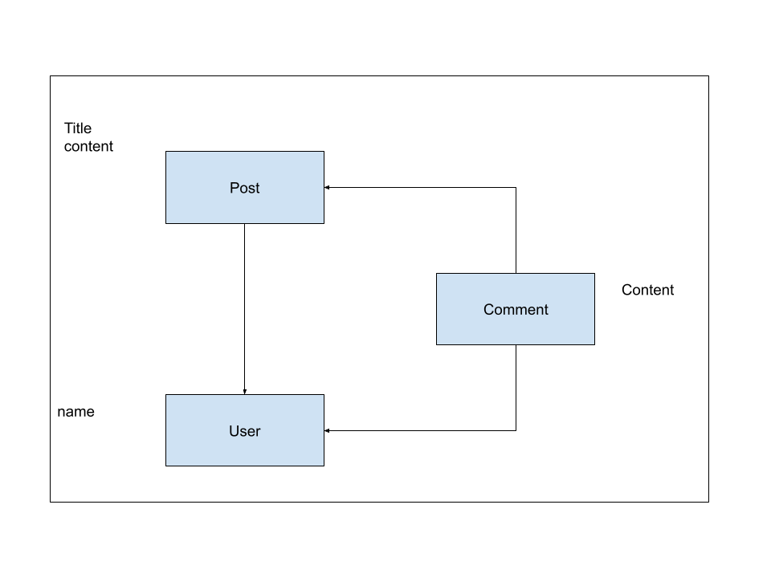

# README

This README would normally document whatever steps are necessary to get the
application up and running.

Things you may want to cover:

* Ruby version

* System dependencies

* Configuration

* Database creation

* Database initialization

* How to run the test suite

* Services (job queues, cache servers, search engines, etc.)

* Deployment instructions

* ...




## Commands

```shell
$ ruby -v
ruby 3.1.2p20 (2022-04-12 revision 4491bb740a) [x86_64-darwin21]

$ rails -v
Rails 7.0.3.1

$ rails new blog
      create
      create  README.md
      create  Rakefile
      create  .ruby-version
      create  config.ru
      create  .gitignore
      create  .gitattributes
      create  Gemfile
      ...

$ cd blog

$ rails help

$ rails server
=> Booting Puma
=> Rails 7.0.4 application starting in development
=> Run `bin/rails server --help` for more startup options
Puma starting in single mode...
* Puma version: 5.6.5 (ruby 3.1.2-p20) ("Birdie's Version")
*  Min threads: 5
*  Max threads: 5
*  Environment: development
*          PID: 37513
* Listening on http://127.0.0.1:3000
* Listening on http://[::1]:3000
Use Ctrl-C to stop

http://localhost:3000

$ rails generate scaffold user name:string

$ rails db:create
$ rails db:migrate

$ rails console
irb(main):001:0> User.first
irb(main):003:0> User.find(1)
irb(main):007:0> exit

$ curl http://localhost:3000/users/2
$ curl http://localhost:3000/users/2.json

$ rails generate scaffold post title:string content:text user_id:integer
$ rails db:migrate

$ rails console
irb(main):003:0> u = User.find_by(name: 'Fred Flintstone')
irb(main):005:0> u.posts
irb(main):007:0> exit

# Because we added the 'faker' gem...
$ bundle install
Installing faker 3.0.0

$ rails db:drop
$ rails db:create db:migrate

$ rails db:seed

$ rails console
irb(main):001:0> User.count
=> 6
irb(main):002:0> Post.count
=> 24

irb(main):003:0> User.first.posts
irb(main):004:0> exit

$ rails generate scaffold comment content:text user_id:integer post_id:integer

# This does `rails db:drop db:create db:migrate db:seed`...
$ rails db:setup
```
